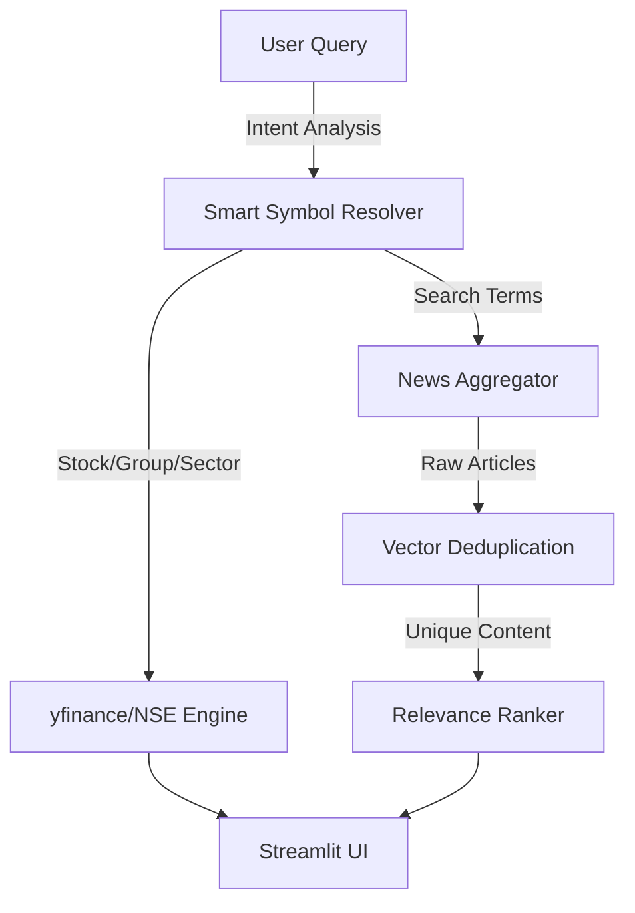

# 🌊 Tradl Flow: AI-Powered Financial Intelligence Engine

**Tradl Flow** is a high-performance, multi-agent financial intelligence system designed to process real-time market data, eliminate information redundancy, and provide context-aware insights. Built for traders and analysts, it bridges the gap between raw news noise and actionable market intelligence.

---

## 🚀 System Overview

Financial markets generate gigabytes of unstructured text data daily. Tradl Flow utilizes **Large Language Models (LLMs)** and **Vector Embeddings** to ingest, deduplicate, and analyze this data stream in real-time.

### Key Capabilities
*   **Multi-Agent Orchestration:** Uses `LangGraph` to manage stateful workflows between Deduplication, Entity Extraction, and Storage agents.
*   **Smart Entity Resolution:** Automatically maps colloquial queries (e.g., "Domino's", "Tata Group") to their specific stock tickers (`JUBLFOOD.NS`, `TATASTEEL.NS`) using a proprietary resolution logic.
*   **Semantic Deduplication:** Utilizes `HuggingFace` embeddings and `ChromaDB` to identify and discard redundant news stories with 95% semantic accuracy.
*   **Real-Time Market Data:** Integrated with NSE/BSE feeds via `yfinance` for live price tracking, P/E ratios, and market cap analysis.
*   **Adaptive UI:** A `Streamlit` dashboard that auto-switches contexts between Stock Analysis, Sector Grids, and Commodity Dashboards based on user intent.

---

## 🛠️ Technical Architecture

### 1. High-Level Data Flow


### 2. The Tech Stack
| Component | Technology | Description |
| :--- | :--- | :--- |
| **Orchestration** | `LangGraph` | Manages cyclic agent workflows and state. |
| **LLM Inference** | `Ollama (Llama 3.2)` | Local inference for entity extraction and summarization. |
| **Vector DB** | `ChromaDB` | High-performance vector storage for similarity search. |
| **Embeddings** | `SentenceTransformers` | `all-MiniLM-L6-v2` model for text-to-vector conversion. |
| **Backend API** | `FastAPI` | Asynchronous REST API handling data resolution and serving. |
| **Frontend** | `Streamlit` | Interactive dashboard with custom CSS and State Management. |
| **Data Sources** | `yfinance`, `GoogleNews` | Real-time market data and news scraping. |

---

## 🧠 Core Algorithmic Logic

### A. Intelligent Deduplication
To prevent the "echo chamber" effect of financial news, Tradl Flow implements a Vector Similarity check.
1.  Incoming article text is vectorized using `all-MiniLM-L6-v2`.
2.  A query is sent to `ChromaDB` to find the nearest neighbor.
3.  **Threshold Logic:**
    *   If **Distance < 0.5**: Flagged as Duplicate (ignored).
    *   If **Distance > 0.5**: Treated as New Intelligence (ingested).

### B. Smart Symbol Resolution
The system employs a heuristic resolution engine (`stocks.py`) to handle ambiguity:
*   **Brand-to-Stock:** Maps "Maggi" → `NESTLEIND.NS`.
*   **Group Logic:** Maps "Adani" → `[ADANIENT, ADANIPORTS, ADANIGREEN]`.
*   **Sector Logic:** Maps "Banks" → Top 5 Nifty Bank stocks.

### C. News Ranking Algorithm
News is not displayed randomly. It passes through a priority filter:
*   **Recency Score:** Articles containing "Just now" or "mins ago" receive +100 points.
*   **Keyword Score:** Articles containing "Surge", "Q3 Results", "Dividend" receive +20 points.
*   **Sorting:** The frontend renders articles in descending order of their calculated Rank.

---

## 🔌 API Reference

The backend exposes the following REST endpoints via `FastAPI`:

### 1. Resolve & Fetch
**Endpoint:** `POST /resolve_and_fetch`
*   **Description:** The brain of the operation. Accepts a raw string, resolves the intent, fetches market data, and returns the view type.
*   **Payload:** `{"query": "Domino's"}`
*   **Response:**
    ```json
    {
      "type": "stock",
      "data": { "symbol": "JUBLFOOD", "price": 450.2, "change": 2.5 ... },
      "note": "Domino's is operated by Jubilant Foodworks"
    }
    ```

### 2. Market Summary
**Endpoint:** `GET /market_summary`
*   **Description:** Fetches live indices (NIFTY 50, SENSEX) and top gainers/losers.

### 3. Ingest News
**Endpoint:** `POST /ingest_news`
*   **Description:** Triggers the scraper and ranking engine for specific topics.
*   **Payload:** `{"query": "Tata Steel, Steel Sector"}`

---

## 💻 Installation & Setup

### Prerequisites
*   Python 3.10+
*   [Ollama](https://ollama.com/) installed and running (`ollama run llama3.2`)

### 1. Clone the Repository
```bash
git clone https://github.com/papilo-topato/Tradl-Flow.git
cd Tradl-Flow
```

### 2. Set up Virtual Environment
```bash
python -m venv venv
# Windows
venv\Scripts\activate
# Mac/Linux
source venv/bin/activate
```

### 3. Install Dependencies
```bash
pip install -r requirements.txt
```

### 4. Run the System
**Terminal 1 (Backend Engine):**
```bash
python main.py
```
*Server runs at http://localhost:8000*

**Terminal 2 (Frontend Interface):**
```bash
streamlit run frontend_streamlit.py
```

---

## 📂 Project Structure

```text
Tradl-Flow/
├── main.py                 # FastAPI Backend Entry Point
├── frontend_streamlit.py   # Interactive UI (Streamlit)
├── graph.py                # LangGraph Agent Definitions
├── database.py             # ChromaDB Vector Store Logic
├── processor.py            # News Scraper & Ranking Algorithms
├── stocks.py               # Market Data & Symbol Resolution Engine
├── requirements.txt        # Python Dependencies
└── README.md               # Documentation
```

> **Note:** Currently, I used a flat structure for rapid prototyping, but in a production environment, I would refactor this into a modular `app/` package with separate `api`, `core`, and `ui` directories.

---

## 🔮 Future Roadmap
*   **Sentiment Analysis v2:** Fine-tuning a financial BERT model for more accurate sentiment scoring.
*   **Portfolio Integration:** Allowing users to upload their portfolio for personalized news filtering.
*   **Technical Indicators:** Adding RSI and MACD alerts directly into the dashboard.

---

## 👨‍💻 About the Developer

**Raghuram K S**
*Engineer | Product Thinker | AI & No-Code Builder*

Exploring the intersection of AI, automation, and electronics. Previously at EPS, building AI strategies and tech execution.

[](https://www.linkedin.com/in/papilo-topato)
[](https://github.com/papilo-topato)
[](https://x.com/papilo_topato)

---
*Built for the Tradl Hackathon 2025.*
