# 🌊 Tradl Flow: Autonomous Financial Intelligence Engine


**Tradl Flow** is a high-performance, multi-agent financial intelligence system designed to process real-time market data, eliminate information redundancy, and provide context-aware insights. Built for traders and analysts, it bridges the gap between raw news noise and actionable market intelligence.

> **[📘 Read the Full Technical Case Study (Architecture & Engineering)](TECHNICAL_DOCS.md)**

---

## 🚀 Key Capabilities

### 1. 🧠 Smart Symbol Resolver
Automatically maps colloquial queries to specific tickers using a proprietary resolution logic.
*   "Domino's" → `JUBLFOOD.NS`
*   "Tata" → `TCS`, `TATASTEEL`, `TATAMOTORS`

### 2. 📄 Document Analyst (RAG Pipeline)
A drag-and-drop research tool that digests 50-page earnings reports instantly.
*   **Gatekeeper AI:** Filters out non-financial content (Movies, Sports).
*   **Analysis:** Generates Executive Summary, Sentiment, and Impact Analysis.

### 3. ⚖️ Stock Face-Off
A comparative analysis engine that fetches real-time metrics for two assets and uses Llama 3.2 to generate a verdict based on news sentiment.

### 4. 💸 Zero Cost Architecture
*   **Local Inference:** Uses **Ollama** to run Llama 3.2 locally.
*   **Free Data:** Uses `yfinance` and `GoogleNews` for real-time data.

---

## 🛠️ Technical Architecture

```mermaid
graph TD
    User(["👤 User"]) -->|Query| UI["💻 Streamlit UI"]
    UI -->|API Call| API["⚡ FastAPI Backend"]
    
    subgraph "Core Intelligence Engine"
        API -->|1. Resolve| Resolver["🧠 Smart Resolver"]
        Resolver -->|Ticker| YF["📈 Yahoo Finance"]
        Resolver -->|Keywords| News["📰 Google News"]
        
        News -->|Raw Text| Scraper["🕷️ Scraper"]
        Scraper -->|Clean Text| LLM["🦙 Llama 3.2 (Local)"]
        
        LLM -->|Analysis| Verdict["💡 AI Verdict"]
    end
    
    YF -->|Live Data| UI
    Verdict -->|Insights| UI
```



### 1. The Dashboard Experience
The interface is designed for high-density information display, featuring a dark mode for reduced eye strain and a "Live Ticker" for market pulses.


*Caption: The central command center showing the Search Bar, Quick Access Modules, and the Live Pipeline Visualizer.*

### 2. Context-Aware Visualizations
When a user searches for a specific sector (e.g., "Banks"), the system automatically switches to a **Grid View** to allow for rapid comparison of peers.


*Caption: The Sector Grid View automatically populating top banking stocks with live P/E and Market Cap metrics.*

### 3. The "Stock Face-Off" Engine
A dedicated module for comparative analysis. It fetches real-time metrics for two assets and uses the LLM to generate a comparative verdict based on news sentiment.


*Caption: Side-by-side comparison of HDFC vs. SBI, featuring an AI-generated verdict on short-term strength.*

### 4. Under the Hood: The Workflow
The system visualizes the tech stack in real-time, showing the hand-off between the User, the Resolver, the Data Swarm, and the AI Model.


*Caption: The "Glass Box" AI approach—visualizing the LangGraph agent states in real-time.*

### Prerequisites
*   Python 3.10+
*   [Ollama](https://ollama.com/) installed and running (`ollama run llama3.2`)

### 1. Clone the Repository
```bash
git clone https://github.com/papilo-topato/Tradl-Flow.git
cd Tradl-Flow
```

### 2. Set up Virtual Environment
```bash
python -m venv venv
# Windows
venv\Scripts\activate
# Mac/Linux
source venv/bin/activate
```

### 3. Install Dependencies
```bash
pip install -r requirements.txt
```

## 📦 Tech Stack & Packages Used
*   **Core Framework**: [LangChain](https://www.langchain.com/) & [LangGraph](https://langchain-ai.github.io/langgraph/) (Agentic Workflows)
*   **LLM Engine**: [Ollama](https://ollama.com/) (Running Llama 3.2 locally)
*   **Frontend**: [Streamlit](https://streamlit.io/) (Interactive Dashboard)
*   **Backend**: [FastAPI](https://fastapi.tiangolo.com/) (High-performance API)
*   **Data Sources**: 
    *   `yfinance` (Market Data)
    *   `GoogleNews` (News Aggregation)
    *   `BeautifulSoup4` (Web Scraping)
*   **Vector Database**: [ChromaDB](https://www.trychroma.com/) (Document Embeddings)


### 4. Run the System
**Terminal 1 (Backend Engine):**
```bash
python main.py
```
*Server runs at http://localhost:8002*

**Terminal 2 (Frontend Interface):**
```bash
streamlit run frontend_streamlit.py
```

---

## 👨‍💻 About the Developer

**Raghuram K S**
*Aspiring AI Engineer | Product Thinker*

I sit at the intersection of **Electronics, AI, and Product**. With a background in Electronics & Communication and experience in business strategy at EPS, I build systems that are not just technically sound but solved real-world problems.

[](https://www.linkedin.com/in/papilo-topato)
[](https://github.com/papilo-topato)
[](https://x.com/papilo_topato)

---
*Built for the Tradl Hackathon 2025.*
